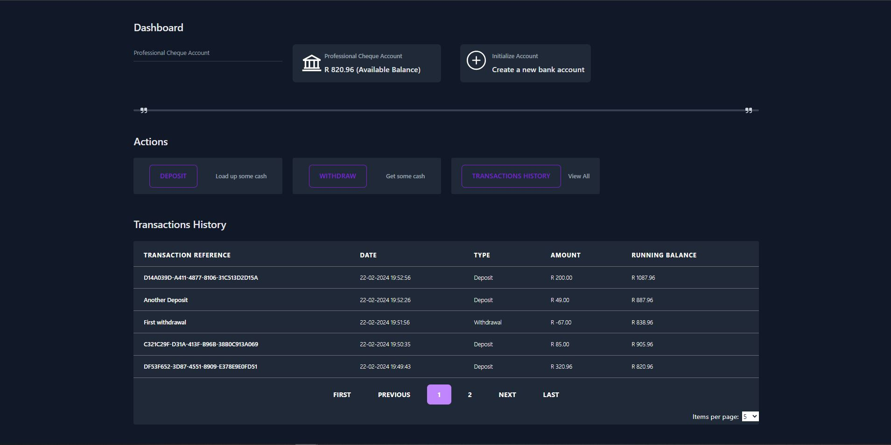

<br/>
## 💻 Live Demo:

[http://simple-banking-web-app-lb-1268003747.eu-west-1.elb.amazonaws.com/](http://simple-banking-web-app-lb-1268003747.eu-west-1.elb.amazonaws.com/)
<br/>

## 🏦🏧 Simple Banking (simulation)

With [The Simple Banking App](http://simple-banking-web-app-lb-1268003747.eu-west-1.elb.amazonaws.com/) users get interact with a few couple of simulated banking transactions.

Features developed in this project include:

— Initializing/creating new bank accounts<br />
— Deposit funds into a bank account<br />
— Withdraw funds from a bank account<br />
— View all transactions in a bank account<br />
— Switch active bank account<br />
— View all bank accounts<br />
<br />

This project comprises of 2 solutions:)<br />
— SimpleBanking.Api (Developed using .NET 8 and Entity Framework)<br />
— simple-banking-ui (Developed using React.js, Typescript along with Tailwindcss.)

<br/>

<br/>

## ⚡ Install

- Clone the repository:
```bash
git clone https://github.com/lerato1ofwan/simple-banking.git

```

## ✨ Getting Started

### 🖳 SimpleBanking.Api
- Make sure you have the dotnet 8 SDK, and ASPNET CORE 8 runtime installed on your machine, they are provided by Microsoft [here](https://dotnet.microsoft.com/en-us/download/dotnet/8.0)
- You need a test database, you can use docker image of MSSQL, simply [install docker](https://docs.docker.com/engine/install/) on your machine and afterwards run the following commands:
``` 
docker pull mcr.microsoft.com/mssql/server:2022-latest
```
``` 
docker run -e "ACCEPT_EULA=Y" -e "MSSQL_SA_PASSWORD=<your_strong_password>" -p 1433:1433 -d mcr.microsoft.com/mssql/server:2022-latest 
```
- You need to add this connection for your database in appSettings.json
```
  "ConnectionStrings": {
   "DefaultConnection": "Server=localhost,1433;Database=simplebankingdb;User Id=SA;Password=<your_strong_password>;TrustServerCertificate=True;Integrated Security=False;"
  },
```
- You need to apply the migrations as the project uses a Code First Approach, open a terminal in the root of the project:
```
cd Server/SimpleBanking.Api
```
```
dotnet ef database update
```
Or alternatively, open sln file in Visual Studio, and in the integration package manager console, running the following command:
```
Update-Database
```

- Your Api is now ready to go!

### 🖥 simple-banking-ui

- Make sure you already have `Node.js` and `npm` installed in your system.
- You need an environment variable to point to your API, run your API and grab the URL
- Then, create a .env file on the base root of your simple-banking-ui (Should be under /Client/simple-banking-ui from the project root)
- In your created .env file add (Important to note: after the api URL add a "/api" e.g https://localhost:7231/api) </br >
`
REACT_APP_BASE_API_URL=replace-this-with-your-api-url
`
- Install the packages using the command <br />
 `npm install`


- Your UI is ready to run, execute the following command in your project root <br />
 `npm start`
</br >
#### 🚀 Happy hacking!
</br >

## Using Docker
TBC

## 📙 Used libraries

Check `packages.json` for details

Check `SimpleBanking.Api.csproj` for details

## Future features & updates
TBC
